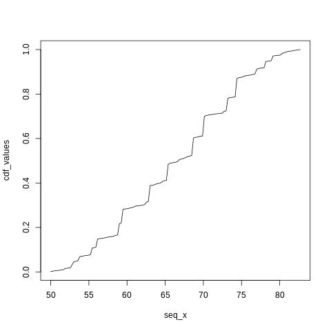

# Cummulative Distributive Function
This is the file for the implementation of the Cummumlative Distributive Function.
CDF is the distributive function of X such that X takes values less than or equal to x.

 
The CDf defines the proportion of the data below a cutoff a. To define the proportion of values above a, we will compute:

To define the proportion of values  between a and b, we compute:

Following plot is the output of the CDF function.

